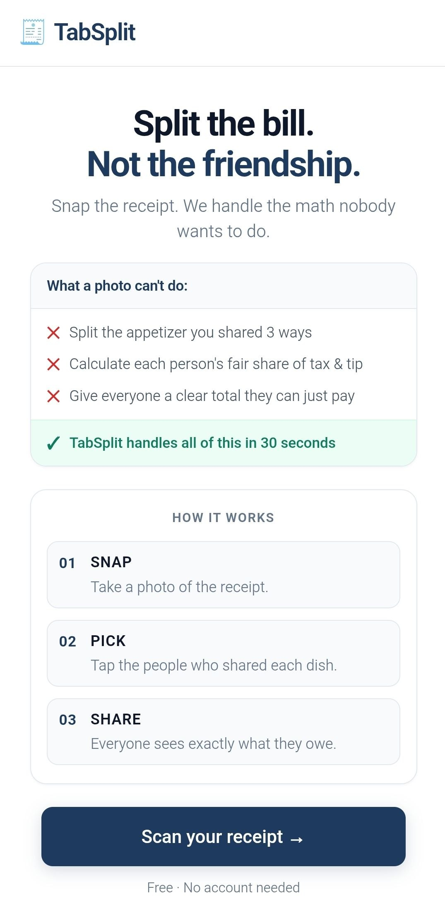
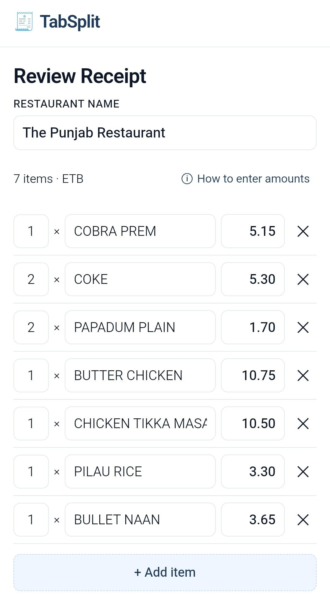
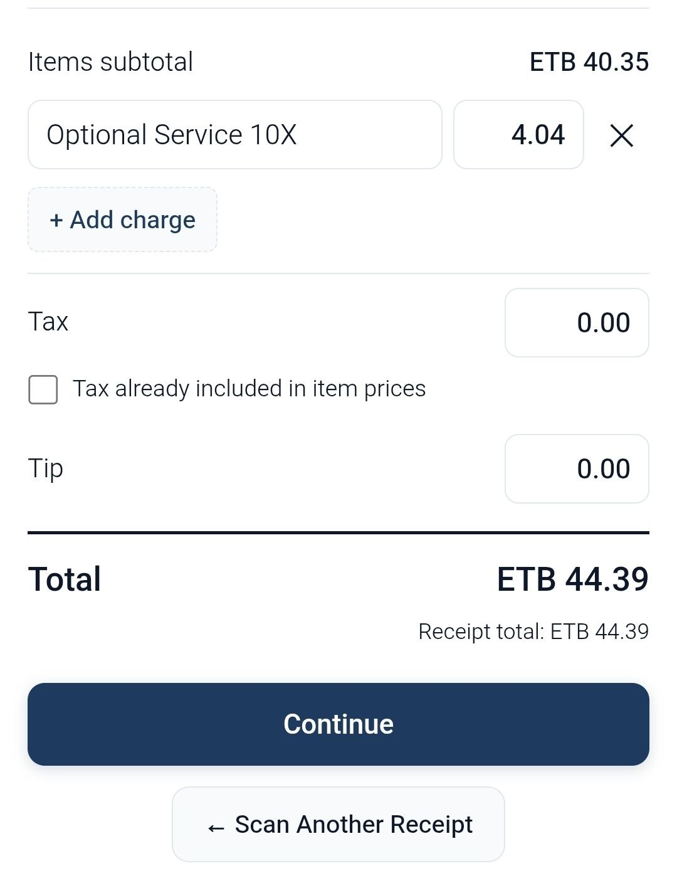
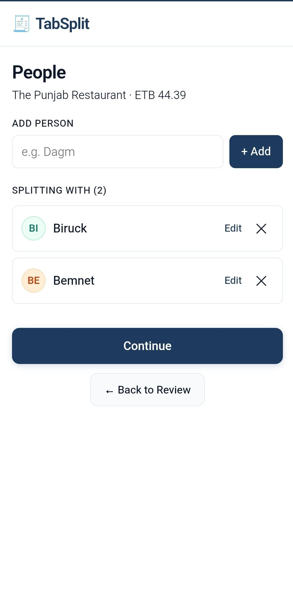
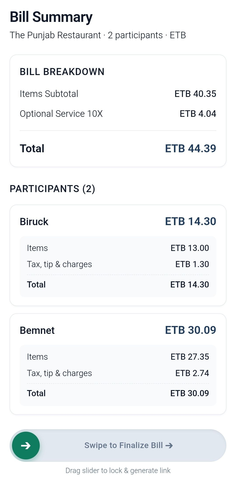
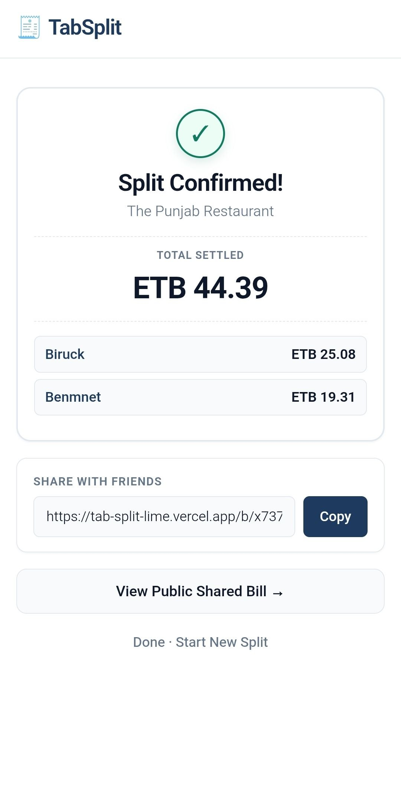

TabSplit

Split the bill. Not the friendship.

TabSplit is a mobile-first receipt splitting app that makes it easy for groups to split restaurant bills. Take a photo of a receipt, review the extracted items, add your friends, assign items, and instantly generate a shareable bill.

What TabSplit Does

TabSplit turns a restaurant receipt into a shared bill in a few simple steps:

Scan → Review → Add People → Assign → Share

📸 Take a photo or upload a receipt
🤖 AI extracts the restaurant name, items, prices, tax, and total
✏️ Review and correct anything the AI got wrong
👥 Add the people sharing the bill
🍕 Assign each item to one or more people
🧮 Automatically calculate each person’s share
🔗 Generate a shareable link
📱 Friends can open the link on their phones without creating an account

The app currently supports ETB and USD.

Screenshots

### Landing Page

  

### Receipt Review

  
  

### Assign Items

  

### Bill Summary

  

### Shared Bill

  

Live Demo

🌐 **Live Demo:** [TabSplit](https://tab-split-lime.vercel.app/)

You can use TabSplit directly from your browser. It works on both desktop and mobile, including phone camera and gallery uploads.

Tech Stack
Frontend
React
JavaScript
Vite
Tailwind CSS
React Router
Axios
Progressive Web App (PWA)
Backend
Node.js
Express.js
JavaScript
Multer
REST API
Database
Supabase
PostgreSQL
Row Level Security (RLS)

AI
Google Gemini API
Vision-capable Gemini model for receipt extraction
Deployment
Vercel — Frontend
Render — Backend
Supabase — Database
Architecture

TabSplit uses a simple client-server architecture where the frontend never communicates directly with Gemini or Supabase.

                ┌──────────────────────┐
                │       User           │
                │  Phone / Desktop     │
                └──────────┬───────────┘
                           │
                           ▼
                ┌──────────────────────┐
                │   React + Vite       │
                │      Frontend        │
                │       Vercel         │
                └──────────┬───────────┘
                           │
                     REST API
                           │
                           ▼
                ┌──────────────────────┐
                │   Node + Express     │
                │       Backend        │
                │       Render         │
                └───────┬───────┬──────┘
                        │       │
                Receipt │       │ Finalized
                 Image  │       │ Bill
                        ▼       ▼
              ┌────────────┐ ┌──────────────┐
              │   Gemini   │ │   Supabase   │
              │    Vision  │ │ PostgreSQL   │
              └────────────┘ └──────────────┘

Abel = 300 ETB
